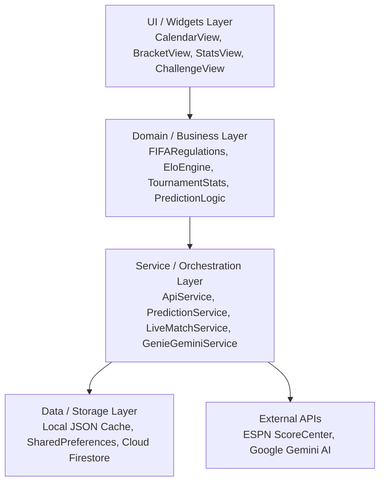

# 📐 Manuel d'Architecture & Charte d'Ingénierie — Prono Challenge (Mondial 2026)

---

## 1. Philosophie & Cadre d'Ingénierie

Tout développement, audit et extension sur la plateforme **Prono Challenge (Mondial 2026)** respecte scrupuleusement les **5 Piliers d'Ingénierie Inébranlables** :

```text
       ┌─────────────────────────────────────────────────────────────┐
       │             LES 5 PILIERS D'INGÉNIERIE FLUTTER              │
       └─────────────────────────────────────────────────────────────┘
          │                   │                   │
  ┌───────▼───────┐   ┌───────▼───────┐   ┌───────▼───────┐
  │   VÉRITÉ &    │   │  ARCHITECTURE │   │  QUALITÉ &    │
  │   RIGUEUR     │   │   RÉACTIVE    │   │  TESTS PURS   │
  │ (Zéro-Fake)   │   │  (Clean Core) │   │ (0 Diagnostics)
  └───────────────┘   └───────────────┘   └───────────────┘
          │                                       │
  ┌───────▼───────┐                       ┌───────▼───────┐
  │  RÉSILIENCE   │                       │ EXPÉRIENCE UX │
  │ IA & FALLBACK │                       │  & MULTI-i18n │
  │ (Anti-429)    │                       │  (WCAG AA)    │
  └───────────────┘                       └───────────────┘
```

---

## 2. Pilier 1 : Vérité Mathématique, Déterminisme & Zéro Fake (FIFA Official 104-Match Standard)

- **Archive Officielle Intégrale (104 Matchs)** :
  - **72 Matchs de Poules** : 12 groupes de 4 équipes ($A$ à $L$), départage conforme aux règlements officiels de la FIFA (Points $\to$ Différence de buts $\to$ Buts marqués $\to$ Confrontation directe $\to$ Fair-Play disciplinaire).
  - **32 Matchs à Élimination Directe** : 16es de finale ($m73$-$m88$), 8es ($m89$-$m96$), Quarts ($m97$-$m100$), Demi-finales ($m101$-$m102$), 3e Place ($m103$) et Finale ($m104$).
  - **Zéro Équipe Fantôme (TBD)** : L'ensemble du tableau et de l'arbre final est entièrement résolu, cohérent et interconnecté de bout en bout.
- **Principe d'Ingestion Systémique (Anti-Pansement)** :
  - Interdiction absolue de corriger un nœud isolé sans recalculer et réaligner l'ensemble des dépendances amont/aval du graphe.
  - Lorsqu'un jeu de données de référence est fourni, le pipeline d'ingestion régénère l'arbre complet avec sa source unique de vérité (`assets/initial_matches.json`).
- **Invariance Topologique de Graphe (Graph Invariance)** :
  - Tout nœud enfant dans un arbre de tournoi dépend strictement et sans exception des nœuds parents (`child.team ∈ {parent.winner, parent.loser}`).
  - Des tests unitaires dédiés vérifient cette invariance topologique à chaque compilation, interdisant formellement qu'un champion soit couronné sans avoir gagné sa demi-finale et son quart.
- **Moteur de Cotes & Score Elo Dynamique** :
  - Formule Elo officielle pondérée par l'importance du tournoi ($K=60$ pour la Coupe du Monde) :
    $$R_{\text{new}} = R_{\text{old}} + K \times (S - E)$$
    $$E = \frac{1}{1 + 10^{(R_{\text{opp}} - R)/600}}$$
  - Les cotes $1X2$ et les probabilités de titre sont recalculées en temps réel après chaque match selon la performance sportive réelle.

---

## 3. Pilier 2 : Architecture Réactive, Clean Architecture & Séparation des Couches

L'application repose sur un découplage strict entre la présentation, les règles métier du tournoi et la persistance :



- **Single Source of Truth** : Les matchs et classements sont synchronisés via un modèle immuable (`WorldCupMatch`) doté d'une résolution unifiée des scores, prolongations et tirs au but.
- **Offline-First & Résilience Réseau** : En l'absence de réseau ou de synchronisation distante, les données locales statiques (`assets/initial_matches.json`) fournissent instantanément l'intégralité du tournoi et des statistiques sans écran blanc.

---

## 4. Pilier 3 : Qualité de Code, Zéro Diagnostic Linter & Suite de Tests

- **Norme 0 Avertissement Linter** :
  - Analyse statique `dart analyze` maintenue à **0 erreur, 0 warning, 0 lint info**.
  - Respect scrupuleux des dernières directives Dart 3.x (gestion sémantique des nuls, élimination des API dépréciées, éléments `?` null-aware dans les collections).
- **Harnais de Tests Automatisés (`test/`)** :
  - **Règlements FIFA (`fifa_rules_test.dart`)** : Test des bris d'égalité complexes, points de fair-play disciplinaires et qualification des 8 meilleurs 3es.
  - **Modèle de Données (`match_test.dart`)** : Validation des getters d'état (`isPlayed`, `isFinished`, `isLive`, `isKnockout`) et calculs de vainqueurs en prolongation / tirs au but.
  - **Arbre du Tournoi (`bracket_resolution_test.dart`)** : Assertions automatisées sur les 104 matchs, garantissant l'absence de placeholders `TBD` et la validité de l'arbre complet.
  - **Statistiques Individuelles (`tournament_stats_test.dart`)** : Validation des classements des meilleurs buteurs (Soulier d'Or) et des meilleurs passeurs (Playmakers), avec exclusion des buts contre son camp.
  - **IA & Intelligence Prédictive (`genie_gemini_service_test.dart`)** : Test du comportement dynamique, de la conformité textuelle et du déterminisme de secours.

---

## 5. Pilier 4 : Résilience IA Multimodale (Genie Gemini) & Fallback Déterministe

- **Intelligence Prédictive Hybride** :
  - Intégration de **Google Gemini** pour la génération d'analyses de match enrichies (contexte tactique, forme récente, impact des classements FIFA et cotes de marché).
- **Gestionnaire Anti-Throttling & Cooldown 429** :
  - Mise en place d'un registre de cooldown de 120 minutes en cas de limitation de débit (HTTP 429), basculant immédiatement sur une génération déterministe locale.
- **Moteur de Secours Déterministe basé sur Graine** :
  - Si aucune clé API n'est fournie ou en cas de coupure de service, l'algorithme génère des analyses cohérentes et contextualisées sans aucune interruption pour l'utilisateur.

---

## 6. Pilier 5 : Expérience Utilisateur Élite, Accessibilité & Multi-i18n

- **Design System Néo-Sportif Moderne** :
  - Palette sombre contrastée (`AppColors.background: #0D1117`, `AppColors.card: #161B22`, `AppColors.accent: #58A6FF`, `AppColors.warning: #F59E0B`).
  - Lisibilité optimisée respectant les standards **WCAG AA**.
- **Tableau Interactif & Zoom Dynamique** :
  - Composant `BracketViewWidget` avec connecteurs vectoriels fluides (`CustomPainter`), mise en surbrillance des vainqueurs et navigation horizontale/verticale optimisée.
- **Parité Multilingue Intégrale (100%)** :
  - Prise en charge native et bascule instantanée sans rechargement en **Français 🇫🇷**, **Anglais 🇬🇧** et **Espagnol 🇪🇸**.
  - Plus de 250 clés de traduction synchronisées par langue (noms des pays, stades, arbitres, classements, termes footballistiques et dialogues IA).
