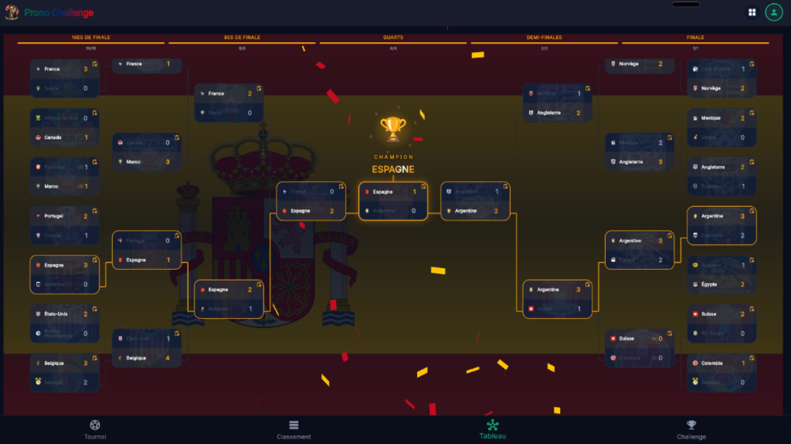
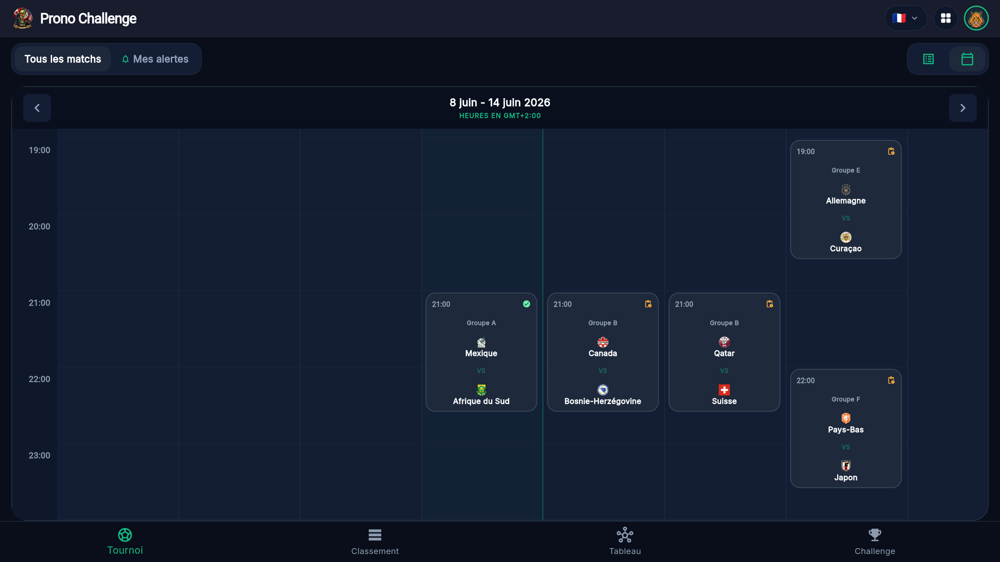
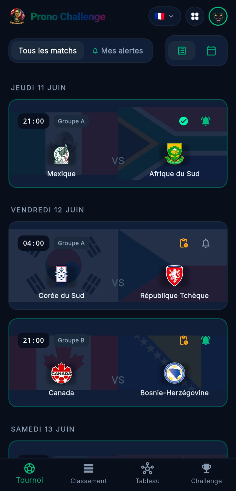
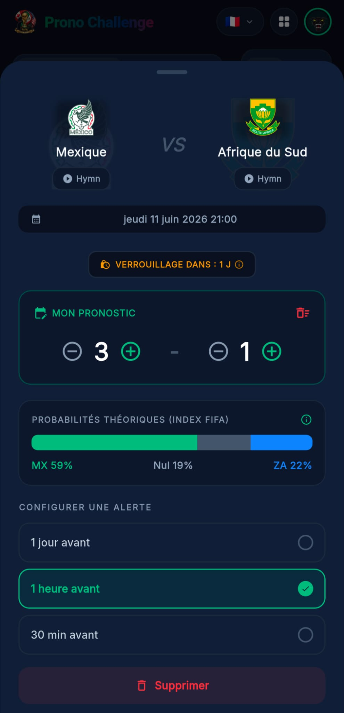
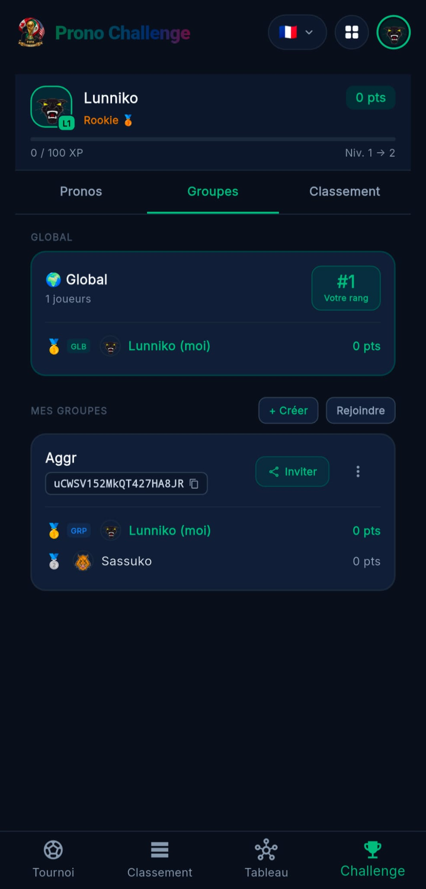
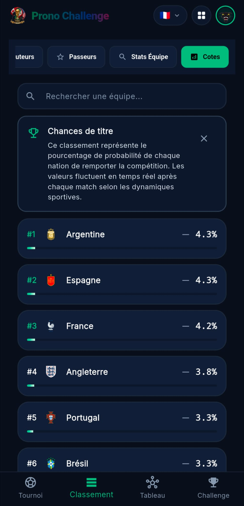

# 🏆 Mondial 2026 - Plateforme de Pronostics & Archive Officielle FIFA™

<div align="center">

[](https://flutter.dev)
[](https://dart.dev)
[](https://firebase.google.com)
[](LICENSE)
[](test/)
[](https://fnnktkygl-code.github.io/mondial_2026/)

### 🌐 [👉 Cliquer ici pour Lancer l'Application Web en Direct](https://fnnktkygl-code.github.io/mondial_2026/) 👈

**[🇬🇧 English Version (README.md)](README.md)** • **[🇪🇸 Versión en Español (LEAME.md)](LEAME.md)**

*Application Flutter multiplateforme (Web, iOS, macOS, Windows & Android) de standard industriel pour la Coupe du Monde FIFA 2026™ — Archive complète des 104 matchs, tableau final à élimination directe résolu, classements des buteurs & passeurs décisifs, et analyses IA.*

</div>

---

## 📱 Vitrine App Store & Web

### 🖥️ Expérience Desktop & Tablette

| 🏆 Tableau Éliminatoire & Champion du Monde | 📅 Calendrier & Résultats des 104 Matchs |
| :---: | :---: |
|  |  |
| *Arbre à élimination directe 32 équipes avec scores réels et connecteurs* | *Filtres par phase, groupe, date et stade avec scores en direct* |

### 📱 Expérience Mobile

| ⚽ 1. Matchs & Calendrier | 📊 2. Fiche de Match & Cotes Elo | 🏆 3. Groupes FIFA & Meilleurs 3es | 🎯 4. Soulier d'Or & Passes Décisives |
| :---: | :---: | :---: | :---: |
|  |  |  |  |
| *Chronologie et scores en temps réel* | *Historique et probabilités* | *Groupes A à L et classement des 3es* | *Classement buteurs et passeurs* |

---

## 🌐 Accès à l'Application Web en Direct

L'application web de production est accessible en ligne via GitHub Pages :
- 🔗 **Lien Direct Web App** : [https://fnnktkygl-code.github.io/mondial_2026/](https://fnnktkygl-code.github.io/mondial_2026/)
- 📦 **Fonctionnement 100% Autonome** : Jeu de données complet des 104 matchs intégré.
- ⚡ **Responsive Multi-Écran** : Optimisé pour mobile, tablette et écran large.

---

## 🏛️ Architecture Logicielle & Standards d'Ingénierie

Le projet repose sur **5 Piliers d'Excellence Technique** :

1. **Rigueur Mathématique & Archive 104 Matchs** :
   - 104 rencontres officielles complètes, incluant prolongations, tirs au but, buteurs et passeurs décisifs.
   - Résolution topologique FIFA ([`FIFARegulations`](lib/utils/fifa_rules.dart)) pour les groupes A à L, meilleurs 3es, 16es, 8es, quarts, demies et finale.

2. **Clean Architecture & État Réactif** :
   - Séparation stricte : Modèles (`lib/models/`), Services (`lib/services/`), Widgets (`lib/widgets/`), et Traductions (`lib/l10n/`).

3. **Parité Trilingue Intégrale (Français, Anglais, Espagnol)** :
   - Support complet de l'interface, des équipes et des statistiques dans [`lib/l10n/translations.dart`](lib/l10n/translations.dart).

4. **100% de Tests Validés & 0 Avertissement Linter** :
   - 49 tests automatisés réussis sur le routage de l'arbre et les classements.
   - `dart analyze` validé avec **0 erreur, 0 avertissement**.

5. **IA Gemini Résiliente** :
   - Service d'analyse tactique avec gestion des quotas et reprises automatiques.

---

## 🚀 Démarrage Rapide

### Prérequis
- Flutter SDK `>=3.29.0`
- Dart SDK `>=3.7.0`

### Installation
```bash
# Cloner le dépôt
git clone https://github.com/fnnktkygl-code/mondial_2026.git
cd mondial_2026

# Installer les dépendances
flutter pub get

# Lancer la suite de tests
flutter test

# Exécuter l'application localement
flutter run -d chrome
```

---

## 📄 Licence
Distribué sous licence MIT. Consultez `LICENSE` pour plus d'informations.
