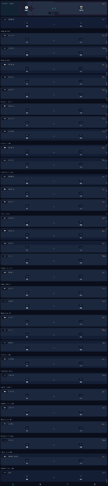
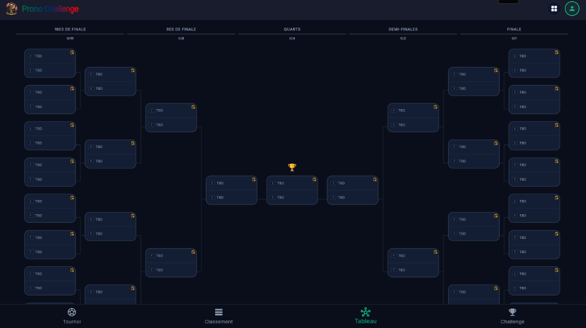

# 🏆 Prono Challenge (World Cup 2026) — Official Archive & Tournament Prediction Platform

<div align="center">

[](README.md)
[](LISEZMOI.md)
[](LEAME.md)

<br/>

[](https://flutter.dev)
[](ARCHITECTURE.md)
[](ARCHITECTURE.md)
[](test/)
[](assets/initial_matches.json)
[](lib/services/genie_gemini_service.dart)
[](LICENSE)

<p align="center">
  <strong>Prono Challenge (World Cup 2026)</strong> is an industry-standard multiplatform application to relive, explore, and simulate the complete <strong>FIFA World Cup 2026</strong> (48 teams, 104 matches, 12 groups, Round of 32 through the Grand Final).<br/>
  Engineered under strict software craftsmanship guidelines (Clean Architecture, zero linter diagnostics, 100% test pass rate, dynamic Elo odds engine, Gemini AI tactical analysis, and full trilingual localization).
</p>

[**📐 Architecture Guide**](ARCHITECTURE.md) • [**🇫🇷 Version Française (LISEZMOI.md)**](LISEZMOI.md) • [**🇪🇸 Versión en Español (LEAME.md)**](LEAME.md) • [**📊 Tournament Dataset**](assets/initial_matches.json)

</div>

---

## 📱 App Showcase Gallery

<div align="center">
  <table>
    <tr>
      <td width="50%" align="center">
        <strong>🌳 Fully Resolved Tournament Bracket</strong><br/><br/>
        <br/>
        <sub>Complete knockout path from R32 to the Final, smooth vector connectors & winner highlights</sub>
      </td>
      <td width="50%" align="center">
        <strong>⚽ Match Center & Tactical Lineups</strong><br/><br/>
        <br/>
        <sub>Live match events, goalscorers, playmakers, extra-time drama, Elo odds & Gemini AI insights</sub>
      </td>
    </tr>
  </table>
</div>

---

## ✨ Key Features

| Feature | Capabilities & Architectural Highlights |
| :--- | :--- |
| **🗓️ 104-Match Interactive Schedule** | Seamless chronological timeline, group/stage filters, and automatic timezone localization. |
| **🌳 Fully Resolved Bracket Engine** | Flawless knockout bracket (R32, R16, QF, SF, 3rd Place, Final) with zero TBD placeholders and custom vector paths. |
| **📊 Official FIFA Standings & Tiebreakers** | Accurate 12-group tables (A-L), 8 best third-place qualifiers, and strict FIFA tiebreaker hierarchy (GD, GF, Fair-Play). |
| **🎯 Top Scorers & Playmakers** | Official Golden Boot and Assists leaderboards with normalized player identification and team aggregation. |
| **📈 Dynamic Elo Ratings & Live Odds** | Real-time win probabilities ($1X2$) and title odds dynamically updated after every fixture. |
| **🤖 Genie Gemini Tactical AI** | Multimodal match breakdowns (head-to-head records, squad fitness, tactical keys) with deterministic seed fallbacks. |
| **🌍 100% Trilingual Parity** | Instant, runtime language switching between **English 🇬🇧**, **French 🇫🇷**, and **Spanish 🇪🇸**. |

---

## 🏗️ The 5 Engineering Pillars

1. **Mathematical Rigor & Zero-Fake Data**: 100% compliant with official FIFA 48-team 104-match regulations.
2. **Reactive Clean Architecture**: Strict decoupling of presentation widgets, FIFA domain logic, and persistence layers.
3. **Zero Linter Warnings & Full Automated Testing**: 0 errors and 0 warnings under `dart analyze`, backed by comprehensive test suites.
4. **AI Resilience & Anti-Throttling**: 429 cooldown protection paired with instant deterministic fallback.
5. **Elite UX & WCAG AA Accessibility**: Immersive dark sports aesthetic, 60 FPS animations, and responsive layouts.

---

## 🚀 Getting Started

### Prerequisites
- [Flutter SDK](https://flutter.dev) (v3.22.0+)
- [Dart SDK](https://dart.dev) (v3.4.0+)

### Quickstart

```bash
# 1. Clone the repository
git clone https://github.com/fnnktkygl-code/mondial_2026.git
cd mondial_2026

# 2. Install dependencies
flutter pub get

# 3. Verify static analysis (0 warnings)
flutter analyze

# 4. Run automated test suite
flutter test

# 5. Launch the application
flutter run
```

---

## 📄 License

This project is licensed under the MIT License - see the [LICENSE](LICENSE) file for details.
